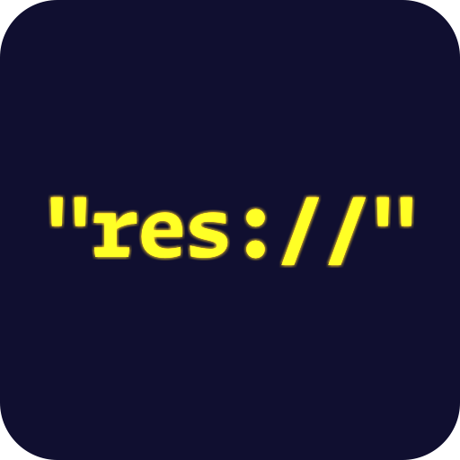

#  Godot Filepath Generator

## About
Filepath Generator generates a GDScript file with constants for `res://` paths to all relevant files in your project, so that in your code you use `ProjectFiles.Scenes.ENEMY` instead of `"res://scenes/enemy/enemy.tscn"`.

### Benefits:
- Moving files won't break your project or add irrelevant changes to your diffs/commits.
- Illegal reference errors are prevented at build/dev time, since you reference constants and not arbitrary strings.

### Configurable (in `addons/filepath_generator/filepath_generator.gd`):
- Project scan frequency (default: every 5 seconds).
- Name/location of the generated file (default: `addons/filepath_generator/project_files.gd`).
- Generated class' names and file extensions they're mapped to.
- Files/directories can be excluded from output (default: the `addons` directory)

## Example

The following project structure

```
- project.godot
- sources/
    - entities/
        - enemy/
            - enemy.tscn
            - enemy.gd
            - enemy_sprite.png
            - enemy_stats.tres
    - levels/
        - tutorial/
            - tutorial.tscn
            - tutorial.gd
    - ui/
        ui_theme.tres
```

would yield

```gdscript
class_name ProjectFiles

class Scenes:
    const ENEMY = 'res://sources/enemy/enemy.tscn'
    const TUTORIAL = 'res://sources/levels/tutorial.tscn'

class Scripts:
    const ENEMY = 'res://sources/enemy/enemy.gd'
    const TUTORIAL = 'res://sources/levels/tutorial.gd'

class Resources:
    const ENEMY_STATS = 'res://sources/enemy/enemy_stats.tres'
    const UI_THEME = 'res://sources/ui/ui_theme.tres'

class Images:
    const ENEMY_SPRITE = 'res://sources/enemy/enemy_sprite.png'
```

## Additional information

1. Names of constants in the generated file are SCREAMING_SNAKE_CASE'd project file's names, so they have to be unique.
2. This plugin periodically scans the whole project. This may have implications for large projects/old computers, although the UI won't freeze because it runs in a separate thread.
3. The generator only runs in the editor and does not do anything in a built game.